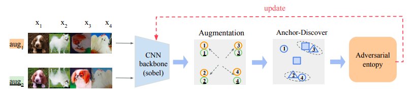
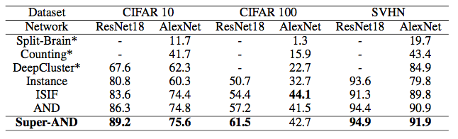
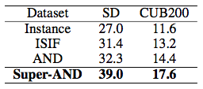
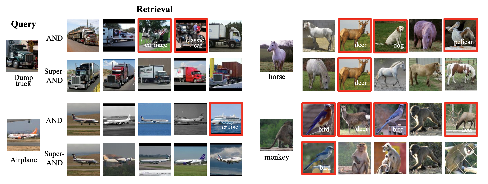
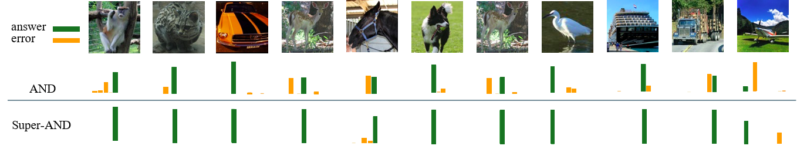

# Super-AND
This repository is the Pytorch implementation of "A Comprehensive Approach to Unsupervised Embedding Learning based on AND Algorithm"
* Illustration of basic architecture in Super-AND.


## Highlight
* We efficiently unify various techniques from state-of-the-art models and introduce a new loss, UE-loss, to make similar data samples gather in the low-density space.
* Super-AND outperforms all baselines in various benchmark datasets. It achieved an accuracy of 89.2% in the CIFAR-10 dataset with the Resnet18 backbone network, compared to the state-of-the-art that gained 86.3%.
* The extensive experiments and ablation study show that every component in Super-AND contributes to the performance increase and also indicate their synergies are critical.


## Experiment
The proposed Super-AND outperforms state-of-the-art baselines and following tables are the main results evaluated on two kinds of datasets: coarse-grained and fine-grained.

* Table 1: kNN Evaluation on coarse-grained datasets



* Table 2: kNN Evaluation on fine-grained datasets




## Qualitative Analysis
Qualitative analysis is conducted to verify our model's superiority. We compared the original AND algorithm and our proposed model Super-AND.
* Figure 1: The nearest retrievals of example queries from STL-10. The upper retrieval row from every query shows the results from the AND model, and the lower ones are from the Super-AND model. The left-side results are successful cases for both models, and the right-side results are failure cases. Images with surrounding red frames indicate the wrongly retrieved negative samples.



* Figure 2: Class probabilities predicted from both AND and Super-AND model on example STL-10 images are illustrated as bars. The green bar represents correctly predicted answers, and the yellow bar represents incorrectly predicted answers.



## Pretrained model
We support the pretrained model for [ResNet18](https://drive.google.com/file/d/1cABTquqOl5N2Wbchxs0-DBI6OVfnqY5J/view?usp=sharing) on CIFAR10 dataset that reached the state-of-the-art accuracy in our paper "Super-AND: A Holistic Approach to Unsupervised Embedding Learning".

## Usage
1. Clone the repository
```
git clone https://github.com/super-AND/super-AND.git
```
2. Training on CIFAR10 
```
python3 main.py --dataset cifar10 --network resnet18
```
3. (option) Reproduce the result in paper

    Download the file mentioned in pretrained model part then put it to checkpoint dir.
```
python3 main.py --resume ckpt_SAND.t7 --test_only
```
